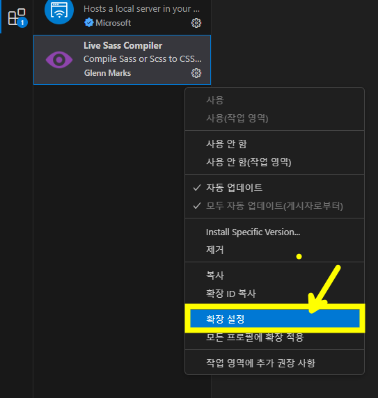

## 1. CSS전처리기
  - CSS를 생성하도록 하는 프로그램
  - 보다 가독성있고, 유지보수가 수월하게 작성할 수 있다.
  - 종류 : SASS, LESS, Stylus, PostCSS

    
***


## 2. VScode에 SASS설정하기
1. 확장(Extension)에서 **[Live Sass Compiler]** 를 설치한다.  
1. 설치 완료 후, 아래 그림과 같이 __[확장 설정]__ 으로 들어간다.
  
     


1. __[Live Sass Compile > Settings: Formats]__ 항목에서
   __[settings.json에서 편집]__ 을 클릭


```json
    "liveSassCompile.settings.formats": [
        {
            "format": "expanded",           //포맷형식을 "expanded" OR "compressed" 둘중에 하나 작성
            "extensionName": ".css",
            "savePath": "~/../css/",        //저장위치 설정
            "savePathReplacementPairs": null
        }
    ]
```
위와 같이 내용수정
